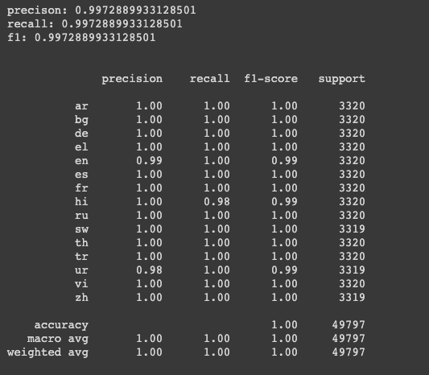

# mT5 Transformer finetuned on XNLI dataset for Language Prediction

- XNLI is an evaluation corpus for language transfer and cross-lingual sentence classification in 15 languages.
- mT5 is pretrained on the mC4 corpus, covering 101 languages
- mT5 was only pre-trained on mC4 excluding any supervised training. Therefore, this model has to be fine-tuned before it is useable on a downstream task. For Example: Language Classification
  
## File Structure
- `data` folder contains the `xnli.test.tsv` and `xnli.dev.tsv`. These files can also be downloaded from [here.](https://cims.nyu.edu/~sbowman/xnli/)
- `output` folder contains the outputs produced by the trained model. I trained the model on a TPU, GPU can also be used(slower) for fine tuning.
- `models` folder contains the model checkpoints and latest model.  
- The trained model can be found on this [drive link.](https://drive.google.com/drive/folders/1VBtbUt66v_gAwM6o0vPVUgqgeGrKbkMk?usp=sharing)
- After downloading the trained model, extract it here in the file structure and rename the folder as `models`

## Steps:
1. ```bash
    pip install -r requirements.txt
    ```
1. Open the `XNLI_MT5Small_Finetuned` notebook. Run the cells one by one.
2. If using TPU, set the flag `ON_TPU` to true.
3. Also if using TPU, set the `MAIN_DIR` and `PATH_TO_DATA` to your respective GCS Bucket
4. If you are not training the model again, download the model from [drive link.](https://drive.google.com/drive/folders/1VBtbUt66v_gAwM6o0vPVUgqgeGrKbkMk?usp=sharing) and run the last cell for the predictions.

### Model
- The trained model can be found on this [drive link.](https://drive.google.com/drive/folders/1VBtbUt66v_gAwM6o0vPVUgqgeGrKbkMk?usp=sharing)
- Extract the model and rename the folder as `models/`. 
- *Note*: Make sure that the task is registered in the `TaskRegistry`

### Evaluation
The model on following specification produced the following results.
- Learning Rate = 0.003
- Batch Size = 32 if GPU or else 128 if TPU
- EPOCH = 5



### Predictions
- 100% correct predictions on custom data.

```python
inputs = [
    "चलो पार्क चलते हैं",
    "Hãy đến công viên",
    "Vamos a aparcar",
    "Пойдем в парк",
          ]
```

```text
b'hi'
b'vi'
b'es'
b'ru'
```

  
### Limitation
I was only able to train a single model because of my GCP limitation. Therefore, I couldn't thoroughly evaluate the model on different specs. 

### References
1. [XNLI Dataset](https://cims.nyu.edu/~sbowman/xnli/)
2. [XLM-Roberta_XNLI](https://github.com/surbhihirawat88/XLM-Roberta_XNLI/blob/main/XNLI.ipynb)
3. [Fine-Tuning the Text-To-Text Transfer Transformer (T5) for Closed-Book Question Answering](https://github.com/google-research/text-to-text-transfer-transformer/blob/main/notebooks/t5-trivia.ipynb)